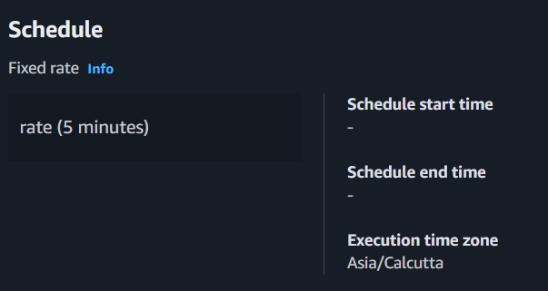
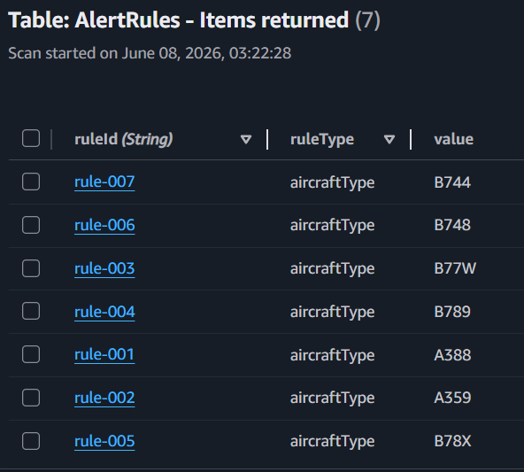
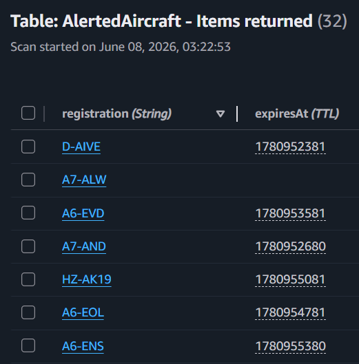
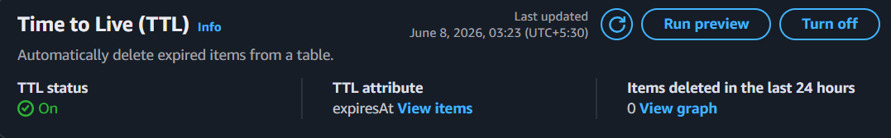
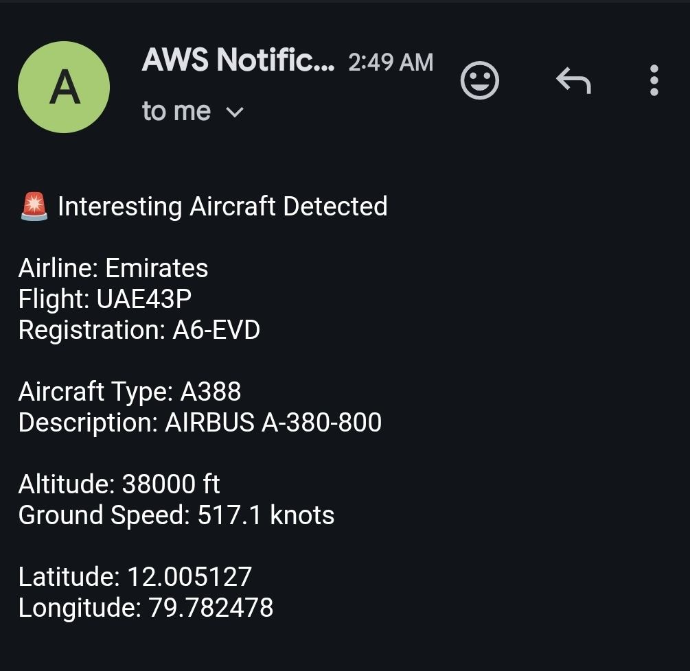

# ✈️ Flight Alert System


A serverless, event-driven aviation monitoring system that detects configured aircraft types operating near **Cochin International Airport (COK)** using AWS Lambda, EventBridge Scheduler, DynamoDB, and Amazon SNS. The system continuously evaluates live telemetry data, enforces duplicate suppression through persistent state management, and delivers real-time email notifications — entirely without server provisioning or manual intervention.

---

## 📌 Overview

The Flight Alert System is built around a configuration-driven, event-driven architecture. An Amazon EventBridge Scheduler triggers an AWS Lambda function on a fixed 5-minute cadence. Lambda dynamically loads monitoring rules from DynamoDB, retrieves live aircraft telemetry from the Airplanes.live API, evaluates each aircraft against the configured rules, and conditionally publishes alerts through Amazon SNS — applying stateful duplicate suppression and automated TTL-based record expiry across each execution cycle.

**Key engineering characteristics:**

- **Serverless** — no EC2 instances, containers, or infrastructure to manage; compute scales on demand via AWS Lambda
- **Event-driven** — fully automated execution cadence managed by Amazon EventBridge Scheduler
- **Stateful duplicate suppression** — DynamoDB provides persistent state across stateless Lambda invocations, preventing repeat notifications for the same aircraft
- **Configuration-driven** — monitored aircraft types are stored in DynamoDB; rules can be added, modified, or removed without any code changes or redeployment
- **Automated data lifecycle** — DynamoDB TTL expires alert records after 24 hours, enabling periodic re-alerting without additional cleanup logic
- **Least-privilege IAM** — Lambda execution role is scoped to only the specific DynamoDB and SNS actions required

---

## 🏗️ Architecture

The system follows a strict sequential execution flow on each invocation:

```
┌─────────────────────────────────────────────────────────────────────────┐
│                              AWS Cloud                                  │
│                                                                         │
│  ┌──────────────────┐     invoke      ┌──────────────────────────────┐  │
│  │ EventBridge      │ ─────────────►  │ AWS Lambda                   │  │
│  │ Scheduler        │                 │ skytracker-alert-processor   │  │
│  │ (every 5 min)    │                 │ Node.js · ESM                │  │
│  └──────────────────┘                 └──────────────┬───────────────┘  │
│                                                      │                  │
│                          ┌───────────────────────────┼──────────────┐   │
│                          │                           │              │   │
│                          ▼                           ▼              │   │
│              ┌───────────────────┐   ┌───────────────────────┐      │   │
│              │ DynamoDB          │   │ Airplanes.live API    │      │   │
│              │ AlertRules        │   │ (External · No Auth)  │      │   │
│              │ (Scan rules)      │   │ 250km radius · COK    │      │   │
│              └───────────────────┘   └───────────────────────┘      │   │
│                                                      │              │   │
│                                                      ▼              │   │
│                                       ┌──────────────────────┐      │   │
│                                       │ DynamoDB             │      │   │
│                                       │ AlertedAircraft      │      │   │
│                                       │ (GetItem / PutItem)  │      │   │
│                                       │ TTL: expiresAt +24h  │      │   │
│                                       └──────────────────────┘      │   │
│                                                      │              │   │
│                                                      ▼              │   │
│                                         ┌─────────────────────┐     │   │
│                                         │ Amazon SNS          │     │   │
│                                         │ skytracker-flight-  │     │   │
│                                         │ alerts              │     │   │
│                                         └──────────┬──────────┘     │   │
│                                                    │                │   │
│  ┌─────────────────────┐    ┌──────────────────┐   │                │   │
│  │ AWS IAM             │    │ Amazon CloudWatch│◄──┘                │   │
│  │ Least-privilege     │    │ Logs & Metrics   │                    │   │
│  │ execution role      │    └──────────────────┘                    │   │
│  └─────────────────────┘                                            │   │
└─────────────────────────────────────────────────────────────────────┘   │
                                                      │
                                                      ▼
                                           📧 Email Subscriber
```

See [`docs/architecture-diagram.png`](docs/architecture-diagram.png) for the full visual diagram.

---

## 📸 Screenshots

| Component | Screenshot |
|-----------|------------|
| Architecture Diagram |  |
| EventBridge Scheduler |  |
| AlertRules DynamoDB Table |  |
| AlertedAircraft DynamoDB Table |  |
| DynamoDB TTL Configuration |  |
| Sample Email Alert |  |

---

## 🔄 End-to-End Workflow

Each execution cycle proceeds through the following stages:

**1. Scheduled Invocation**
Amazon EventBridge Scheduler triggers the `skytracker-alert-processor` Lambda function automatically every 5 minutes via a dedicated IAM execution role. No manual intervention is required at any stage.

**2. Rule Loading from DynamoDB**
Lambda performs a `Scan` operation on the `AlertRules` DynamoDB table to retrieve all active monitoring criteria. This configuration-driven approach means monitored aircraft types can be updated entirely through database writes — no code changes, no redeployments.

**3. Live Telemetry Retrieval**
Lambda issues an HTTP request to the Airplanes.live radial API endpoint:

```
GET https://api.airplanes.live/v2/point/10.1520/76.4019/250
```

This returns real-time telemetry for all aircraft within a 250 km radius of Cochin International Airport (10.1520°N, 76.4019°E), including callsigns, registrations, ICAO type codes, altitudes, speeds, and geographic coordinates. The endpoint requires no authentication and provides direct radius-based filtering, avoiding large global state-vector datasets.

**4. Aircraft Matching**
Lambda applies a `filter()` over all aircraft in the API response, retaining only those whose ICAO type code matches an active rule from DynamoDB. All matching aircraft are collected and processed individually — not just the first match.

**5. Duplicate Suppression via DynamoDB State**
For each matching aircraft, Lambda performs a `GetItem` lookup against the `AlertedAircraft` table using the aircraft's registration as the partition key. If a record exists, the alert is suppressed. This pattern implements persistent state management within an otherwise stateless serverless function — a key design consideration for event-driven architectures.

**6. SNS Notification**
If no existing record is found, Lambda publishes an alert to the `skytracker-flight-alerts` SNS topic. The notification payload includes the resolved airline name (derived from the callsign prefix via an internal lookup table), callsign, registration, aircraft type, altitude, speed, and position.

**7. Alert State Persistence**
Immediately after publishing, Lambda writes the aircraft registration to the `AlertedAircraft` table via `PutItem`, recording the alert timestamp and an `expiresAt` TTL attribute set to 24 hours in the future.

**8. Automated Record Expiry via DynamoDB TTL**
DynamoDB's native TTL mechanism evaluates stored records against the `expiresAt` Unix timestamp and automatically deletes expired items after the TTL period elapses. This resets the alert state per aircraft on a rolling 24-hour window without requiring any additional cleanup logic, scheduled jobs, or Lambda invocations.

---

## 📁 Project Structure

```
Flight-Alert-System/
│
├── lambda/
│   └── index.mjs                    # Core Lambda function (Node.js ESM)
│
├── docs/
│   ├── architecture-diagram.png     # Full AWS architecture diagram
│   ├── eventbridge-scheduler.png    # EventBridge schedule configuration
│   ├── lambda.png                   # Lambda function configuration
│   ├── dynamodb-alert-rules.png     # AlertRules table — items view
│   ├── dynamodb-alert-history.png   # AlertedAircraft table — items view
│   ├── dynamodb-ttl.png             # DynamoDB TTL configuration
│   ├── sns-topic.png                # SNS topic configuration
│   └── sns-email-alert.png          # Sample delivered email alert
│
├── package.json                     # Project metadata
│
└── README.md                        # This file
```

---

## 🛠️ AWS Services

| Service | Role in Architecture |
|---------|----------------------|
| **AWS Lambda** | Core processing engine — Node.js ESM runtime; stateless execution with external state managed via DynamoDB |
| **Amazon EventBridge Scheduler** | Managed scheduler; invokes Lambda on a fixed 5-minute rate expression without requiring a dedicated compute resource |
| **Amazon DynamoDB** | Dual-purpose NoSQL store: `AlertRules` for configuration-driven rule loading; `AlertedAircraft` for stateful duplicate suppression with TTL-based expiry |
| **Amazon SNS** | Managed pub/sub notification delivery; decouples alert generation from subscriber management |
| **Amazon CloudWatch** | Execution logging, invocation metrics, and error visibility across all Lambda runs |
| **AWS IAM** | Least-privilege execution role scoped to `dynamodb:GetItem`, `dynamodb:PutItem`, `dynamodb:Scan`, and `sns:Publish` |

---

## 🗄️ DynamoDB Schema

### `AlertRules` — Configuration Table

Stores the set of active aircraft monitoring rules. Loaded dynamically by Lambda on every execution. Rules can be modified at runtime without touching application code.

| Attribute | Type | Description | Example |
|-----------|------|-------------|---------|
| `ruleId` | String (PK) | Unique rule identifier | `rule-001` |
| `ruleType` | String | Rule category | `aircraftType` |
| `value` | String | ICAO type code to monitor | `A388` |

**Monitored aircraft type codes:**

| Code | Aircraft |
|------|----------|
| `A388` | Airbus A380-800 |
| `A359` | Airbus A350-900 |
| `A35K` | Airbus A350-1000 |
| `B744` | Boeing 747-400 |
| `B748` | Boeing 747-8 |
| `B77W` | Boeing 777-300ER |
| `B77L` | Boeing 777 Freighter |
| `B789` | Boeing 787-9 |
| `B78X` | Boeing 787-10 |

### `AlertedAircraft` — State Table

Maintains per-aircraft alert state across Lambda invocations. Enables stateful duplicate suppression within a stateless serverless execution model. TTL attribute drives automated record expiry.

| Attribute | Type | Description | Example |
|-----------|------|-------------|---------|
| `registration` | String (PK) | ICAO aircraft registration | `A6-EUA` |
| `alertedAt` | String | ISO 8601 alert timestamp | `2024-11-15T14:32:00Z` |
| `expiresAt` | Number | Unix TTL timestamp (+24h) | `1731772320` |

---

## 📊 Results

The deployed system achieves the following operational outcomes:

- **Fully automated execution** — zero manual steps required after initial deployment; EventBridge drives the entire invocation lifecycle
- **Dynamic alert configuration** — monitored aircraft types managed entirely through DynamoDB, enabling runtime rule changes without code modifications or Lambda redeployments
- **Reliable duplicate suppression** — stateful `GetItem`/`PutItem` pattern prevents repeated notifications for aircraft that remain in the monitored airspace across multiple scheduler cycles
- **Self-resetting alert state** — DynamoDB TTL automatically expires records after 24 hours, eliminating the need for separate cleanup processes or scheduled maintenance jobs
- **Multi-aircraft processing** — `filter()`-based detection evaluates all aircraft in the API response simultaneously, enabling concurrent alerts for multiple matching aircraft in a single invocation
- **Zero server management** — the entire platform operates on AWS managed services; no patching, scaling, or infrastructure configuration is required

---

## 💰 Cost Considerations

The system was designed to operate within AWS Free Tier limits for personal and educational use. The serverless architecture minimises cost by eliminating idle compute: Lambda is billed only for actual invocation duration, and DynamoDB charges are negligible at low request volumes.

| Service | Free Tier Allowance | Estimated Usage |
|---------|---------------------|-----------------|
| **AWS Lambda** | 1M requests / 400,000 GB-seconds per month | ~8,640 invocations/month at low duration |
| **Amazon DynamoDB** | 25 GB storage, 25 WCU, 25 RCU | Minimal — small item counts, infrequent writes |
| **Amazon SNS** | 1,000 email notifications per month | Low — alerts fire only on new aircraft |
| **Amazon EventBridge Scheduler** | 14M invocations per month (standard) | ~8,640 invocations/month |
| **Amazon CloudWatch** | 5 GB log ingestion, 10 custom metrics | Low — short log payloads per invocation |

At the expected invocation rate (288 executions per day), operational costs for this system remain effectively zero under standard personal use. Costs would only become material at significantly higher invocation frequencies or data volumes beyond Free Tier thresholds.

---

## 🚀 Deployment

### Prerequisites

- AWS account with permissions to create Lambda, DynamoDB, SNS, EventBridge Scheduler, and IAM resources
- Node.js 18+ (for local development and packaging)
- AWS CLI configured with appropriate credentials

### Steps

**1. Create the SNS topic and subscribe your email**
```bash
aws sns create-topic --name skytracker-flight-alerts

aws sns subscribe \
  --topic-arn <YOUR_TOPIC_ARN> \
  --protocol email \
  --notification-endpoint your@email.com
```

**2. Create DynamoDB tables**
```bash
# AlertedAircraft — state table with TTL
aws dynamodb create-table \
  --table-name AlertedAircraft \
  --attribute-definitions AttributeName=registration,AttributeType=S \
  --key-schema AttributeName=registration,KeyType=HASH \
  --billing-mode PAY_PER_REQUEST

aws dynamodb update-time-to-live \
  --table-name AlertedAircraft \
  --time-to-live-specification Enabled=true,AttributeName=expiresAt

# AlertRules — configuration table
aws dynamodb create-table \
  --table-name AlertRules \
  --attribute-definitions AttributeName=ruleId,AttributeType=S \
  --key-schema AttributeName=ruleId,KeyType=HASH \
  --billing-mode PAY_PER_REQUEST
```

**3. Populate AlertRules with monitoring criteria**

Insert one item per aircraft type code (e.g. `A388`, `B77W`, `B789`). Each item requires `ruleId`, `ruleType: "aircraftType"`, and `value: "<ICAO_CODE>"`.

**4. Deploy the Lambda function**

Upload `lambda/index.mjs` and configure the following environment variables:

| Variable | Description | Example |
|----------|-------------|---------|
| `SNS_TOPIC_ARN` | ARN of the SNS topic | `arn:aws:sns:ap-south-1:...` |
| `REGION` | AWS deployment region | `ap-south-1` |

**5. Attach IAM permissions to the Lambda execution role**

```json
{
  "Effect": "Allow",
  "Action": [
    "dynamodb:GetItem",
    "dynamodb:PutItem",
    "dynamodb:Scan",
    "sns:Publish"
  ],
  "Resource": [
    "arn:aws:dynamodb:<REGION>:<ACCOUNT>:table/AlertRules",
    "arn:aws:dynamodb:<REGION>:<ACCOUNT>:table/AlertedAircraft",
    "arn:aws:sns:<REGION>:<ACCOUNT>:skytracker-flight-alerts"
  ]
}
```

**6. Create the EventBridge Scheduler rule**

Configure a rate-based schedule (`rate(5 minutes)`) targeting the Lambda function ARN, with a new or existing IAM role granted `lambda:InvokeFunction` on the target.

---

## 📧 Sample Alert

```
Subject: ✈️ Aircraft Alert – Emirates A380 Detected Near COK

Airline:      Emirates
Callsign:     UAE214
Registration: A6-EUA
Type:         A388 – Airbus A380-800
Altitude:     37,000 ft
Speed:        487 kts
Position:     10.4821°N, 76.1094°E
```

---

## 📐 Cloud Engineering Concepts Demonstrated

| Concept | Implementation |
|---------|----------------|
| **Serverless computing** | AWS Lambda eliminates server provisioning; compute is event-driven and auto-scaling |
| **Event-driven architecture** | Amazon EventBridge Scheduler drives the entire invocation lifecycle |
| **State management in stateless systems** | DynamoDB provides persistent state across ephemeral Lambda executions |
| **Configuration-driven design** | `AlertRules` table externalises monitoring logic; runtime changes require no code deployment |
| **Automated data lifecycle management** | DynamoDB TTL handles record expiry without scheduled jobs or additional Lambda functions |
| **Managed pub/sub notifications** | Amazon SNS decouples alert publishing from subscriber management |
| **External API integration** | Airplanes.live radial endpoint provides unauthenticated real-time telemetry |
| **IAM least-privilege access** | Execution role scoped to the minimum required actions and specific resource ARNs |
| **Operational observability** | CloudWatch Logs captures structured execution output for every invocation |
| **NoSQL data modelling** | Partition key design supports O(1) `GetItem` lookups for high-frequency duplicate checks |

---

## 📄 License

MIT License. See [`LICENSE`](LICENSE) for details.
